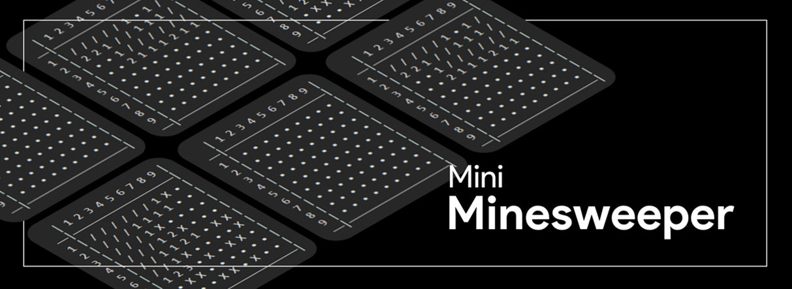

A command-line version of the classic game Minesweeper, implemented using Java.\ 
This is my first project for practicing OOP and programming, any feedback is greatly appreciated :)

# Instructions

You win if you mark every mine or revealing every cell that's not a mine - however, if you mark a mine as free, you lose!\
\
Input is in the format [x] [y] [free / mine], for example "1 1 free" or "2 3 mine".

